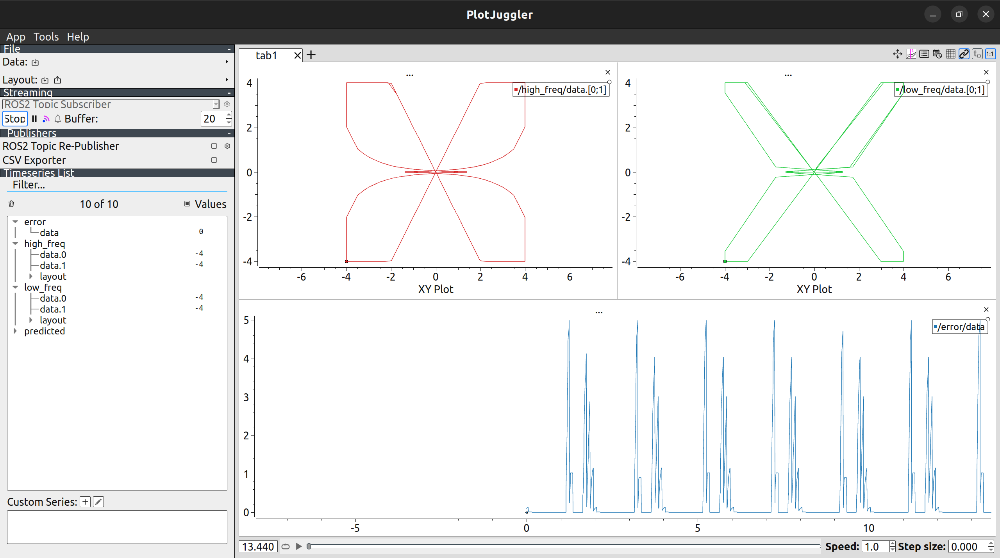

# Kalman Filtering Test Environment

This is an environment for testing Kalman filtering algorithms with ROS2.

You can launch the main simulator with

```shell
ros2 launch launch/launch_sim_nodes.py
```

You can run a simple estimator (that just republishes low-frequency velocities) using:

```shell
ros2 run square_robot_sim simple_republisher
```

Once an estimate of the velocity is published to `/predicted` at a frequency higher than 1Hz,
you can see the error (L2 norm) on the /error topic

It is recommended to use [Plotjuggler](https://github.com/facontidavide/PlotJuggler)

Make sure to install the ROS2 version of Plotjuggler

